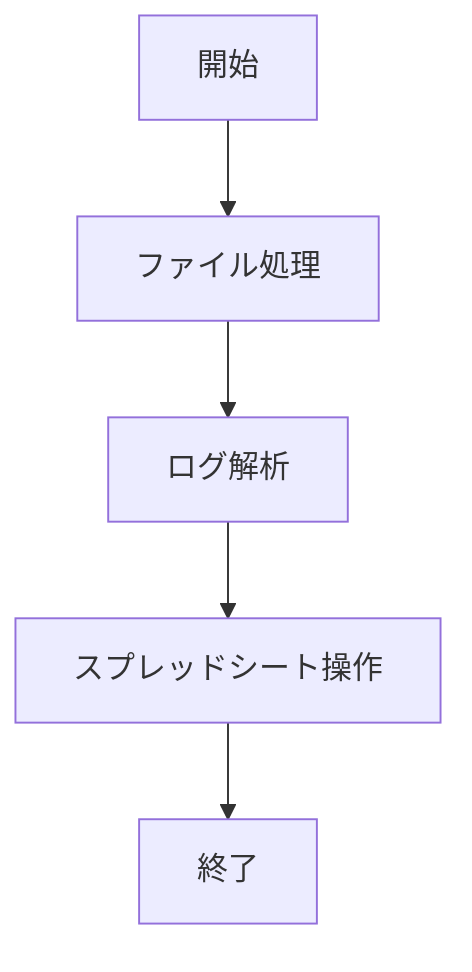

# スクリプト群のREADME

このドキュメントでは、Google Apps Scriptを使用してGoogle Drive内の最新ファイルのデータを解析し、その内容をGoogleスプレッドシートに転記するスクリプト群について説明します。

## 概要

| 機能名称 | 処理概要 |
|---|---|
| ファイル処理 | 指定されたフォルダからファイルを取得し、ログデータを解析してスプレッドシートに書き込む |
| ログ解析 | ログファイルの内容を解析し、日付、時刻、アクティビティを抽出する |
| スプレッドシート操作 | 解析したログデータをスプレッドシートに書き込み、重複を排除し、アクティビティごとのシートを作成する |

## スクリプト構成

- `index.ts`: メインのスクリプトファイル。プロセスの開始点です。
- `fileHandler.ts`: Google Driveから最新のファイルを取得し、その内容を読み込むための関数を含みます。
- `logParser.ts`: ログファイルの内容を解析し、必要なデータを抽出するための関数を含みます。
- `spreadsheetHandler.ts`: 解析したデータをGoogleスプレッドシートに書き込むための関数を含みます。

## 処理フロー

## 処理詳細
1. **ファイル処理**
   - 指定されたフォルダからファイルを取得し、タイムスタンプが古い順にソートする。
   - 各ファイルに対してログ解析を行い、処理済みフォルダに移動する。

2. **ログ解析**
   - ファイルから読み取った内容を行ごとに分割し、日付と各行の時刻とアクティビティを解析する。

3. **スプレッドシート操作**
   - 解析したログデータをスプレッドシートに書き込む。
   - スプレッドシート内の重複データを排除する。
   - 各アクティビティごとに新しいシートを作成し、関連するデータを表示する。

## 使用方法

1. Google Apps Scriptプロジェクトを作成します。
2. 上記のスクリプトファイルをプロジェクトに追加します。
3. スクリプトのプロパティに`folderId`（Google DriveのフォルダID）と`spreadsheetId`（スプレッドシートのID）を設定します。
4. `index.ts`の`main`関数を実行してプロセスを開始します。

## 注意事項

- スクリプトを実行するには、Google DriveとGoogleスプレッドシートへのアクセス権が必要です。
- `folderId`と`spreadsheetId`は、スクリプトのプロパティとして正しく設定する必要があります。
- スプレッドシートには`Data`という名前のシートが必要です。存在しない場合は新しく作成されます。

## ライセンス

このスクリプト群は[MITライセンス](https://opensource.org/licenses/MIT)の下で公開されています。
